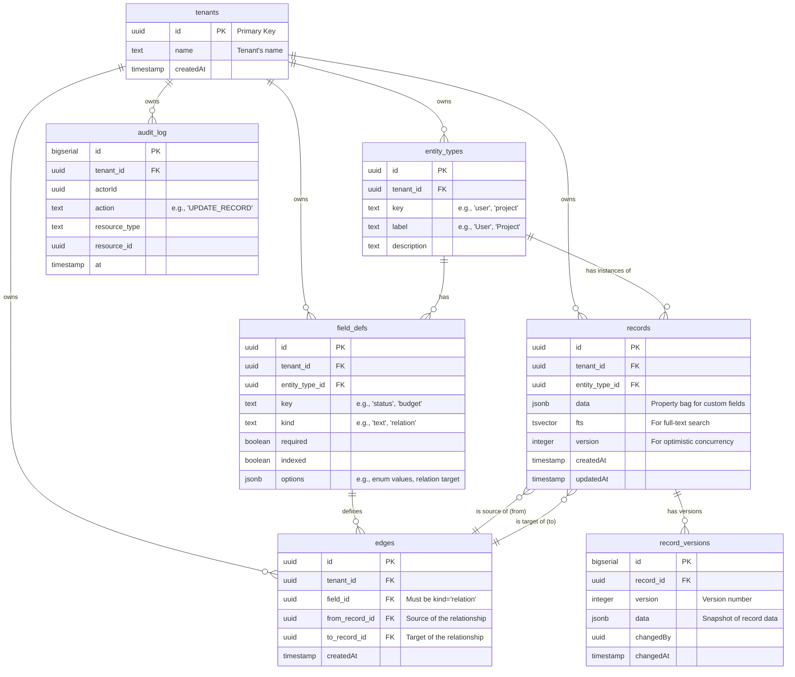

# Database Entity Relationship Diagram

This diagram visualizes the database schema for the Dynamic Data Management System, showing all tables and their relationships.

```mermaid
erDiagram
    tenants {
        uuid id PK "Primary Key"
        text name "Tenant's name"
        timestamp createdAt
    }

    entity_types {
        uuid id PK
        uuid tenant_id FK
        text key "e.g., 'user', 'project'"
        text label "e.g., 'User', 'Project'"
        text description
    }

    field_defs {
        uuid id PK
        uuid tenant_id FK
        uuid entity_type_id FK
        text key "e.g., 'status', 'budget'"
        text kind "e.g., 'text', 'relation'"
        boolean required
        boolean indexed
        jsonb options "e.g., enum values, relation target"
    }

    records {
        uuid id PK
        uuid tenant_id FK
        uuid entity_type_id FK
        jsonb data "Property bag for custom fields"
        tsvector fts "For full-text search"
        integer version "For optimistic concurrency"
        timestamp createdAt
        timestamp updatedAt
    }

    edges {
        uuid id PK
        uuid tenant_id FK
        uuid field_id FK "Must be kind='relation'"
        uuid from_record_id FK "Source of the relationship"
        uuid to_record_id FK "Target of the relationship"
        timestamp createdAt
    }

    record_versions {
        bigserial id PK
        uuid record_id FK
        integer version "Version number"
        jsonb data "Snapshot of record data"
        uuid changedBy
        timestamp changedAt
    }

    audit_log {
        bigserial id PK
        uuid tenant_id FK
        uuid actorId
        text action "e.g., 'UPDATE_RECORD'"
        text resource_type
        uuid resource_id
        timestamp at
    }

    tenants ||--o{ entity_types : "owns"
    tenants ||--o{ field_defs : "owns"
    tenants ||--o{ records : "owns"
    tenants ||--o{ edges : "owns"
    tenants ||--o{ audit_log : "owns"

    entity_types ||--o{ field_defs : "has"
    entity_types ||--o{ records : "has instances of"

    records ||--o{ record_versions : "has versions"
    
    field_defs ||--o{ edges : "defines"

    records }o--|| edges : "is source of (from)"
    records }o--|| edges : "is target of (to)"
```